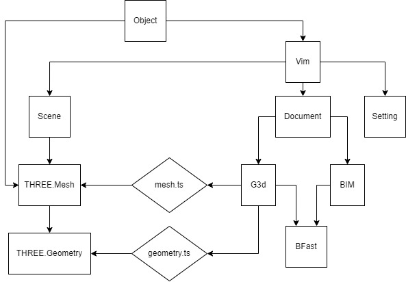

# VIM WebGL Viewer

[](https://npmjs.com/package/vim-webgl-viewer)
[](https://vimaec.github.io/vim-webgl-viewer/)

# Documentation
https://vimaec.github.io/vim-webgl-viewer/api/

# Live Demo

- [Small Model Demo - Residence](https://vimaec.github.io/vim-webgl-viewer)
- [Medium Model Demo - Medical Tower](https://vimaec.github.io/vim-webgl-viewer?model=https://vim.azureedge.net/samples/skanska.vim)
- [Large Model Demo - Stadium](https://vimaec.github.io/vim-webgl-viewer?model=https://vim.azureedge.net/samples/stadium.vim) (_Warning_: slow download times)

# Overview

The VIM WebGL Viewer is an open-source high-performance 3D model viewer built on top of the popular
[Three.JS](https://threejs.org) WebGL framework that specializes
in loading extremely large AEC (Architectural/Engineering/Construction)
models represented as VIM files.

The VIM WebGL viewer combines the Three.JS library with several common loaders and utilities, to reduce boilerplate code. It can be simply included via script tags or consumed using esm imports.

The VIM file format is a high-performance 3D scene format that supports rich BIM data, and can be easily extended to support
other relational or non-relation data sets.

Unlike IFC the VIM format is already tessellated, and ready to render. This results in very fast load times. Unlike glTF the VIM format is faster to load, scales better, and has a consistent structure for relational BIM data.

More information on the vim format can be found here: https://github.com/vimaec/vim

# Using the Viewer from a Web Page

Virtually the simplest usage of the VIM viewer is the following example:

```html
<html>
  <head>
    <title>VIM Viewer</title>
  </head>
  <body>
    <script src="https://unpkg.com/three@0.133.1/build/three.min.js"></script>
    <script src="https://unpkg.com/vim-webgl-viewer"></script>
    <script>

      const viewer = new vim.Viewer()

      viewer.loadVim(
        'https://vim.azureedge.net/samples/residence.vim',
        {
          rotation: { x: 270, y: 0, z: 0 },
        }
      )
    </script>
  </body>
</html>
```

# Running Locally

- Checkout repo
- Run `npm install` to install all dependencies
- Run `npm run dev` to launch a dev-server and watch for change
- Navigate to http://localhost:3000 in your browser

# Folder Structure

- `docs` - this is the root folder for the GitHub page at `https://vimaec.github.io/vim-webgl-viewer`. The `docs\index.html` file is meant demo the latest stable patch release, while the `docs\index-dev.html` Is meant to test the latest dev release.
- `src` - contains the TypeScript source code for the viewer and loader.
- `dist` - created by running the build script for creating a
  distributable package. It contains five items after running the `build` script:
  - `dist\vim-webgl-viewer.es.js` - an EcmaScript module
  - `dist\vim-webgl-viewer.es.js.map` - Typescript source map file map for the EcmaScript module
  - `dist\vim-webgl-viewer.iife.js` - an immediately-invocable function expression (IIFE) intended for consumption from a web-page
  - `dist\vim-webgl-viewer.iife.js.map` - Typescript source map file map for the IIFE
  - `types\` - A folder containing Typescript type declarations for the package.

# For Contributors

## Making a Pre-Release

1. First develop and test the feature using `npm run dev`
2. Login to npm if needed using `npm login`
3. Assure that `git status` is clean
4. Use `npm run release-dev` to create a pre-release NPM package.
5. Change the `docs/index-dev.html` to use the newly published package.
6. Use `npm run serve-docs` to test the npm dev package locally.
7. When satisfied merge current PR into `main`.


## Making a Patch Release

1. Make sure the dev release is working properly at `https://vimaec.github.io/vim-webgl-viewer/index-dev.html`
2. Login to npm if needed using `npm login`
3. Use `npm run release-patch` to create a patch release NPM package.
4. Change the `docs/index.html` to use the newly published package.
5. Push the the new `docs/index.html` to `main`.
6. Make sure `https://vimaec.github.io/vim-webgl-viewer/index.html` is working as expected.

## Scripts

The following scripts are defined in the package.json, and can each be
executed from within VSCode by right-clicking the script name, or from the
command line by writing `npm run <script-name>` where `<script-name>` is the name of the script.


- `dev` - launch a dev environment using Vite
- `build` - compiles an IIFE JavaScript module and ES module using Vite and the configuration file, placing the output in the `dist` folder.
- `bump-dev` - increments the pre-release version of the NPM package, with the id `dev`. This will update the `package.json` version number with a pre-release tag and number value (e.g. 1.0.0-dev.42). It will also create corresponding tag and commit it to Git.
- `publish-dev` - publishes the current package to NPM with a `dev` tag, as opposed to the default tag `latest`.
- `serve-docs` - launches a web-server with the docs folder as the root folder, for testing a published NPM packages (tagged develop or latest) locally
- `release-patch` - Increments the patch number and publishes an NPM package using the default tag (`@latest`). Intended to be called from the `main` branch only after the pre-release package has been created and tested.
- `release-dev` - Increments the prerelease number and publishes an NPM prerelease package using the `@dev` tag. Intended to be called from the `main` branch after the features has been tested and built locally.
- `eslint` - Runs eslint and reports all syntactic inconsistencies.
- `documentation` - Generates api documentation at `docs/api`.
- `declarations` - Generates typescript declrations at `dist/types`. 

## Contributing:

- Source code is formatted using prettier-eslint using the standardjs format.
- On VSCode it is recommended to install ESLint and Prettier ESLint extensions.

## The Sources and Dependencies

The distributable files do not contain the underlying source for [Three.JS](https://threejs.org) to avoid duplication. Please include Three.JS on your own.

## Camera Controls

### Keyboard
**W/Up:** Move camera forward  
**A/Left:** Move camera to the left  
**S/Down:** Move camera backward  
**D/Right:** Move camera to the right  
**E:** Move camera up  
**Q:** Move camera down  
**Shift + direction:** faster camera movement  
**+:** Increase camera speed  
**-:** Decrease camera speed  

**F8:** Toggle orbit mode  
**Home:** Look at model  
**Escape:** Clear selection  
**Z:** Look at selection  

### Mouse
**Hold left click + Move mouse:** Tilt/Pan camera  
**Hold right click + Move mouse:** Truck/Pedestal camera  
**Mouse wheel:** Dolly Camera  
**Left click:** Select object  
**Ctrl + Mouse wheel:** Increase/Decrease camera speed  

### Touch
**One Finger swipe:** Tilt/Pan camera  
**Two Finger swipe:** Truck/Pedestal camera  
**Two Finger pinch/spread:** Dolly Camera  

(https://blog.storyblocks.com/video-tutorials/7-basic-camera-movements/)


## Vim



The `Viewer` provides methods to load and unload `Vim`s.
`Object` is the highest level api and acts as a bridge between `BIM`, `G3d` and `THREE` objects
A `Vim` contains a `Document` which contains the raw `BIM` and `g3d` information parsed from the file.
A `Vim` contains the `Settings` used when loading was called.
A `Vim` contains a `Scene` which contains the generated THREE objects to render the `Vim`.
All raw `G3d` and `BIM` data is stored using the `BFast` format.
`mesh.ts` Takes `G3d` data and `THREE.BufferGeometry` and generates `THREE.Mesh`s.
`geometry.ts` Takes `G3d` and generates `THREE.BufferGeometry`

## How To

**Frame camera on an element**
```javascript
const vim = viewer.getVim(VIM_INDEX)
const object =  vim.getObjectFromElementId(ELEMENT_ID)
viewer.camera.frame(object)
```

**Highlight an element**
```javascript
const wireframe = object.createWireframe()
this.viewer.renderer.add(wireframe)

// To remove hightlight
// this.viewer.renderer.removeObject(wireframe)
```

**Change Color of an element**
```javascript
const vim = viewer.getVim(VIM_INDEX)
const object =  vim.getObjectFromElementId(ELEMENT_ID)
object.changeColor(new THREE.Color(1,0,0))

// Revert to original color
// object.changeColor()
```

**Replace or add behavior on click**
```javascript
// Capture default behavior
const defaultClick = viewer.onMouseClick
// Override the onClick callback
viewer.onMouseClick = (hit) => {
  // Call the default behavior
  defaultClick.bind(viewer)(hit)

  // Add extra logic here
  console.log('My extra behaviour with this entity')
  console.log(hit.object.getBimElement())
}
```

**Load from a custom http request**
```javascript
// Make request as usual
const xhr = new XMLHttpRequest()
// Specify response type ArrayBuffer
xhr.responseType = 'arraybuffer'
xhr.open('GET', url)
xhr.send()
xhr.onload = () => {
// Load vim by passing the array buffer
  viewer.loadVim(xhr.response, {
    rotation: { x: 270, y: 0, z: 0 }
  })
}
```
